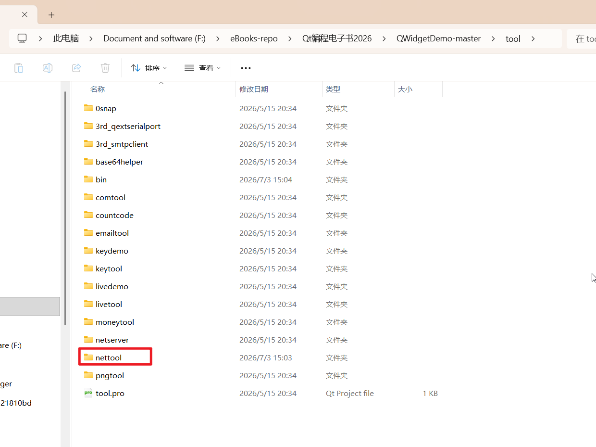

## 一、前言

做网络通信少不了网络收发数据，经常用到网络数据的调试相关工具，以便侦听数据用来判断数据是否正确，许久以前就发布过类似的工具，第一版大概在2013年，第二版大概在2017年，中间参考过不少的网络调试助手，也有些叫网络调试工具等等，个人觉得做得最好的还是野人家园的NetAssist，小巧绿色，功能强大。

中间不少网友提过很多建议，比如为何没有Udp客户端只有Udp服务器，其实Udp通信是无连接的，意味着QUdpSocket即是客户端也是服务器，但是根据众多用户的操作习惯以及编程对称性法则，还是单独又做了个Udp客户端。如今WebSocket也非常流行，客户端工具和网页之间通信可以直接用上socket之类的机制，而且自从Qt5以后有了WebSocket模块，使用非常简单，封装的QWebSocket、QWebSocketServer（很奇怪这里没有叫QWebServer？）和QTcpSocket、QTcpServer、QUdpSocket用法几乎一致。这个项目就是

QWidgetDemo-master/tool/nettool工具程序，也就是从这个网站：https://github.com/feiyangqingyun/QWidgetDemo 下载源码后解压缩，进入tool文件夹里面就可以看到nettool工具项目



### 其实我也复制了这个仓库：https://github.com/kennycaiguo/QWidgetDemo

#### 为了方便学习，我把源码也放在这个文件夹里面

## 二、主要功能

1. Tcp客户端模块。
2. Tcp服务器模块。
3. Udp客户端模块。
4. Udp服务器模块。
5. WebSocket客户端模块。
6. WebSocket服务器模块。
7. 服务器支持多个客户端连接。
8. Ascii字符数据收发。
9. Hex16进制数据收发。
10. 支持Utf8中文数据收发。
11. 可指定网卡IP地址绑定。
12. 可暂停显示收发数据。
13. 定时器自动发送。
14. 可对单个在线连接发送数据，也可勾选全部连接进行发送。
15. 可配置常用发送数据（send.txt），自动从配置文件加载数据发送下拉框的数据。
16. 可启用设备模拟回复（device.txt），当收到某个数据时，模拟设备自动应答回复数据。
17. 自动从配置文件加载最后的界面设置。
18. 同时支持Qt4、Qt5、Qt6。
19. 同时支持win、linux、mac、嵌入式linux、树莓派等。
20. 每个模块功能都是独立的一个Form，可以很方便的直接new，这样需要多少个就new多少个，用户可以任意指定动态新建多个客户端和服务器。

## 三、效果图


## 四、开源主页

**以上作品完整源码下载都在开源主页，会持续不断更新作品数量和质量，欢迎各位关注。** **本开源项目已经成功升级到V2.0版本，分门别类，图文并茂，保你爽到爆。**

1. 国内站点：[gitee.com/feiyangqing…](https://gitee.com/feiyangqingyun/QWidgetDemo)
2. 国际站点：[github.com/feiyangqing…](https://github.com/feiyangqingyun/QWidgetDemo)
3. 个人主页：[qtchina.blog.csdn.net/](https://link.juejin.cn?target=https%3A%2F%2Fqtchina.blog.csdn.net%2F)
4. 知乎主页：[www.zhihu.com/people/feiy…](https://link.juejin.cn?target=https%3A%2F%2Fwww.zhihu.com%2Fpeople%2Ffeiyangqingyun%2F)

## 五、核心代码

```cpp
cpp 代码解读复制代码//第一步：实例化对应的类
tcpSocket = new QTcpSocket(this);
connect(tcpSocket, SIGNAL(connected()), this, SLOT(connected()));
connect(tcpSocket, SIGNAL(error(QAbstractSocket::SocketError)), this, SLOT(disconnected()));
connect(tcpSocket, SIGNAL(disconnected()), this, SLOT(disconnected()));
connect(tcpSocket, SIGNAL(readyRead()), this, SLOT(readData()));

tcpServer = new TcpServer(this);
connect(tcpServer, SIGNAL(clientConnected(QString, int)), this, SLOT(clientConnected(QString, int)));
connect(tcpServer, SIGNAL(clientDisconnected(QString, int)), this, SLOT(clientDisconnected(QString, int)));
connect(tcpServer, SIGNAL(sendData(QString, int, QString)), this, SLOT(sendData(QString, int, QString)));
connect(tcpServer, SIGNAL(receiveData(QString, int, QString)), this, SLOT(receiveData(QString, int, QString)));

udpSocket = new QUdpSocket(this);
connect(udpSocket, SIGNAL(readyRead()), this, SLOT(readData()));

//第二步：收发数据
void frmTcpClient::readData()
{
    QByteArray data = tcpSocket->readAll();
    if (data.length() <= 0) {
        return;
    }

    QString buffer;
    if (App::HexReceiveTcpClient) {
        buffer = QUIHelper::byteArrayToHexStr(data);
    } else if (App::AsciiTcpClient) {
        buffer = QUIHelper::byteArrayToAsciiStr(data);
    } else {
        buffer = QString(data);
    }

    append(1, buffer);

    //自动回复数据,可以回复的数据是以;隔开,每行可以带多个;所以这里不需要继续判断
    if (App::DebugTcpClient) {
        int count = App::Keys.count();
        for (int i = 0; i < count; i++) {
            if (App::Keys.at(i) == buffer) {
                sendData(App::Values.at(i));
                break;
            }
        }
    }
}

void frmUdpClient::readData()
{
    QHostAddress host;
    quint16 port;
    QByteArray data;
    QString buffer;

    while (udpSocket->hasPendingDatagrams()) {
        data.resize(udpSocket->pendingDatagramSize());
        udpSocket->readDatagram(data.data(), data.size(), &host, &port);

        if (App::HexReceiveUdpClient) {
            buffer = QUIHelper::byteArrayToHexStr(data);
        } else if (App::AsciiUdpClient) {
            buffer = QUIHelper::byteArrayToAsciiStr(data);
        } else {
            buffer = QString(data);
        }

        QString ip = host.toString();
        ip = ip.replace("::ffff:", "");
        if (ip.isEmpty()) {
            continue;
        }

        QString str = QString("[%1:%2] %3").arg(ip).arg(port).arg(buffer);
        append(1, str);

        if (App::DebugUdpClient) {
            int count = App::Keys.count();
            for (int i = 0; i < count; i++) {
                if (App::Keys.at(i) == buffer) {
                    sendData(ip, port, App::Values.at(i));
                    break;
                }
            }
        }
    }
}
```

