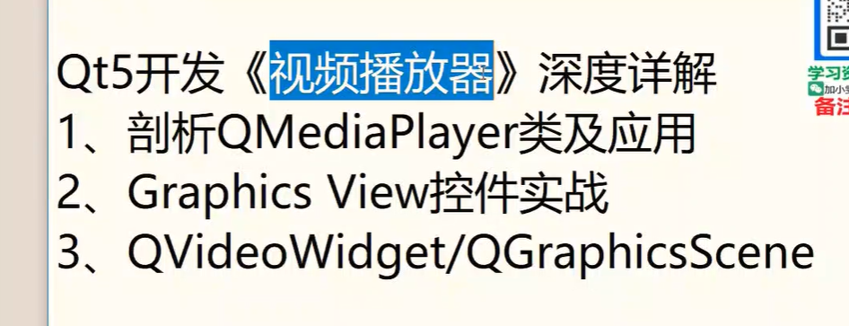
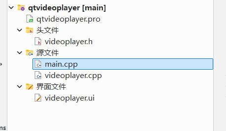
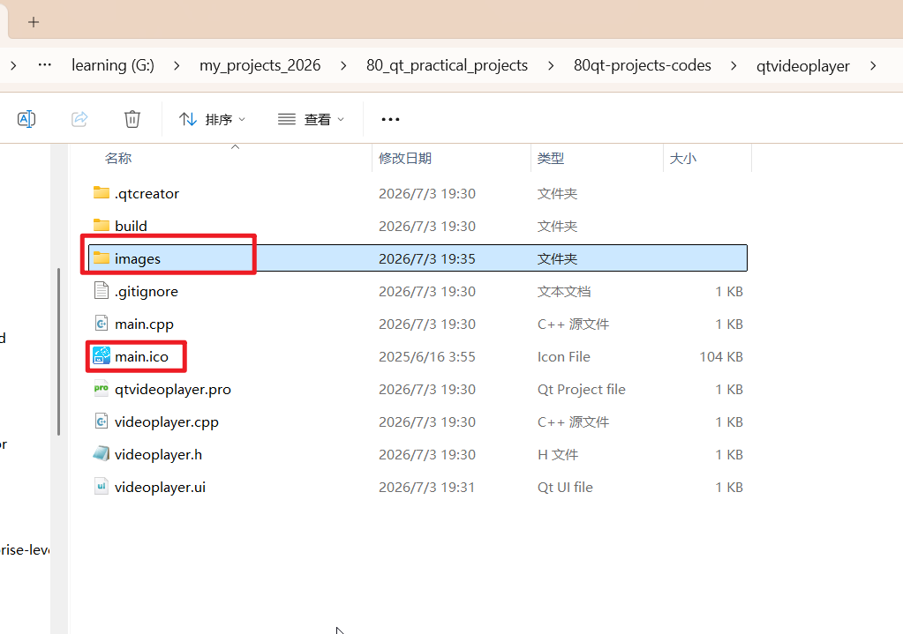
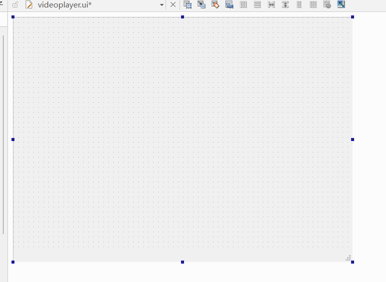
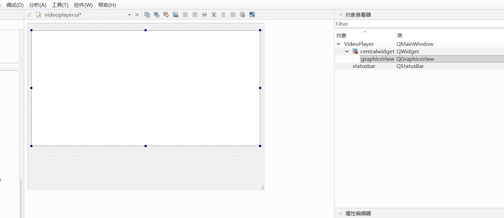
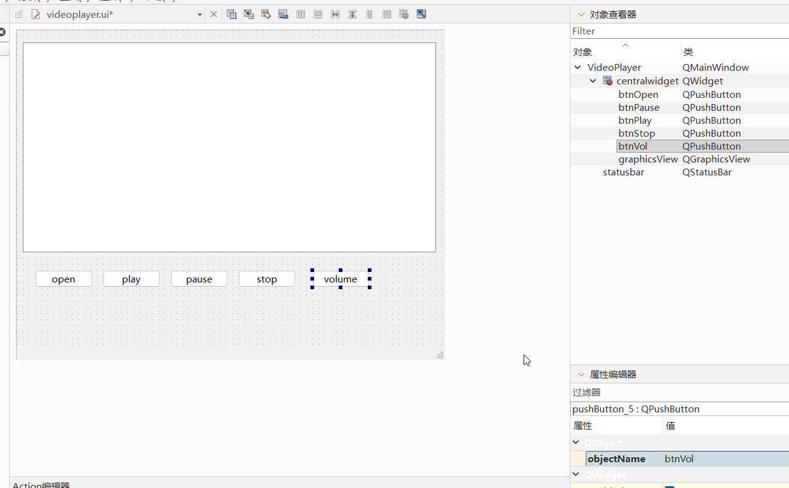
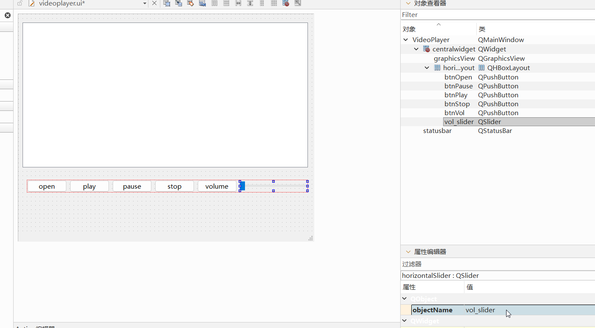
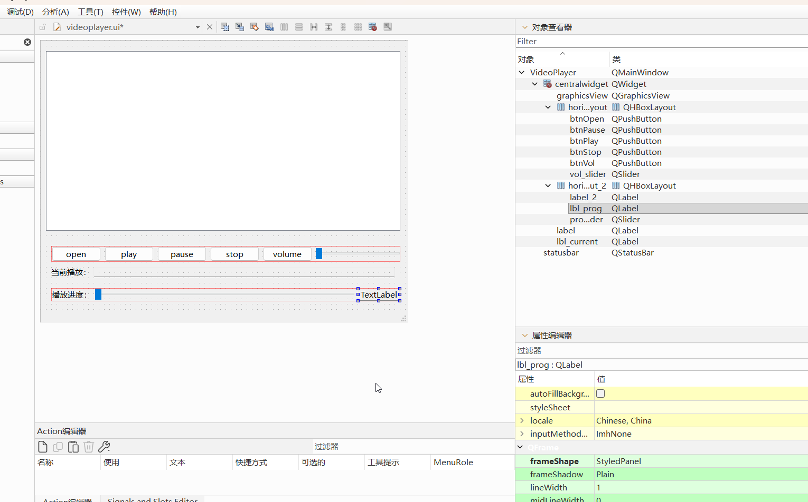

# 1.内容提要

# 2.QMediaPlayer类以及应用

# 3.QGraphicsView控件实战

# 4.QVideoWidget/QGraphicsScene

## 课堂演练

### 1.新建一个qt widget项目，起名qtvideoplayer,继承自QMainWindow，然后我们把我们的主窗口命名为VideoPlayer

### 2.找一些图片，然后在源码文件夹里面新建一个images文件夹，把他们放入这个文件夹，然后找一张ico图标放到源码文件夹里面

### 3.打开ui文件，把菜单删除

### 4.然后我们开始搭建播放器界面，屏幕我们使用GraphicsView控件

### 5.给窗口添加5个按钮

### 6.调整按钮的大小然后在右边添加一个slider，然后选择按钮和滑块，给他们添加视频布局

### 7.然后添加四个label和一个滑块，把当前播放标签右边的标签的内容清空，然后把他的frameShape属性改为StyledPanel，把下面的滑块右边的标签的frameShape属性改为StyledPanel

# 扩展，

## 参考文档1：网址：https://zhuanlan.zhihu.com/p/628172987

## 参考文档2：https://developer.aliyun.com/article/1560358

## 参考文档3： https://developer.aliyun.com/article/1350389

## 参考源码： https://github.com/lmshao/Aurora

## 参考源码2 ： https://github.com/vlc-qt

## 参考源码3：https://github.com/vlc-qt/examples
